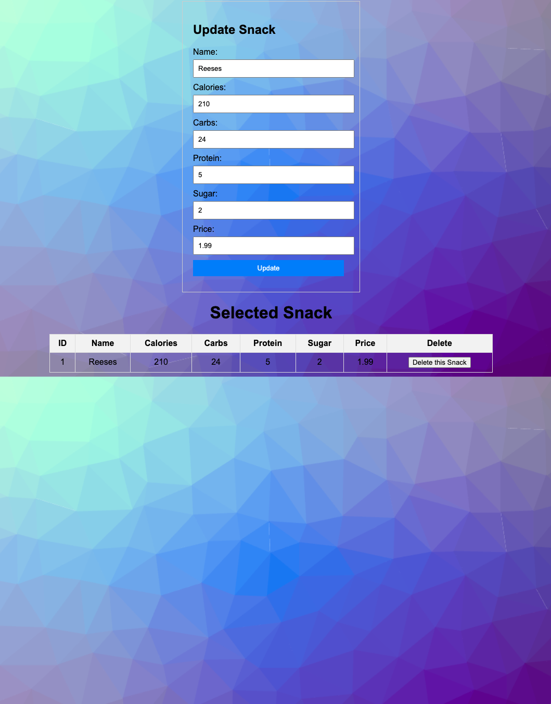

# JPACrudProject

## Description
+ This application was built to facilitace UI with my the database I created with SQL Workbench called snackDB. It utilizes Spring boot, JPA and  Gradle +
+ to interact with the base code and push it to a Tomcat local web server. The application allows a user to: +

- Search Snacks by ID
- Add a new snack in the database
- Update and existing snack in the database
- Delete a snack from the database 
- The snack database is displayed in a table on the Home and Show page
- It is styled with HTML and CSS

## Technology Used

 - STS IDE
 - Gradle
 - Spring boot
 - MAMP  
 - Github
 - Mysql
 - Sublime 
 - MacOS terminal 
 - Java . Microsoft Word 
 - UML
 - Zoom, Slack
 - Tomcat Server
 - Chrome browser
 - Languages: Java, CSS, HTML, MYSQL, Groovy 
 - MySQL Workbench

## Project Goals 

1. Firstly I knew it was going to be a battle to just meet all the required CRUD task being so new to spring boot/
2. I wanted to stretch my abilities with HTML and CSS on my own. Added styling and background. 
3. Build a really clean looking interface and try to maintan organized code. 

## Lessons Learned
@@ I need to review bootstrap procedures to my projects. I tried but couldnt get it to work so I went way old school with CSS and HTML styling within the sheets themselves. @@
@@ Not the ideal way but it turned out really nice. I had to do so much refactoring due to debugging and getting it all to work. Im addition I need a better understanding @@
@@ of JPA and Springboot in general. There is a lot that I dont understand and it still seems like magic. I did add background to my pages finally plus the styling. @@

## Coding Time and Testing
- 12 APR - 1700- 1930 Initial stubbs built out. V1 pushed to GitHub with only the R and D working RUD still needed to be written.
- 13 Apr - 1000-1500 V2 Pushed with CSS, HTML styling still getting an error with C & U.
- 14 Apr - 1000-1430 and 1900-2230 V3  - Final version of the application ALL CRUD is working, JUnit test working and passed, README written. 

### Screenshots 

### Links 

[Project Github repository] (https://github.com/BryRBradley/JPACrudProject)

[About The Developer - Bryan] (https://www.linkedin.com/in/bryan-bradley-a8740190/)